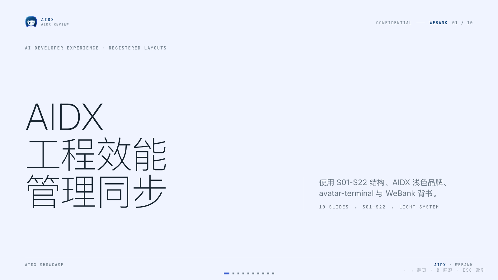
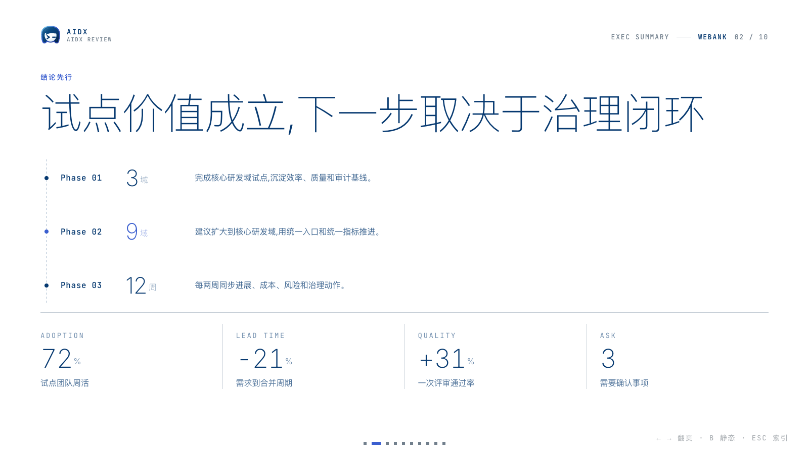

`aidx-ppt-skill` is an agent skill for Claude Code, Codex, and similar coding-agent environments. It generates **AIDX / WeBank internal management review** decks as single-file horizontal-swipe HTML, plus deck visuals and social cover pages.

The current template is **AIDX**: it uses the registered `S01-S22` layout structure, AIDX Color System v1.0.0, the light-background gradient `avatar-terminal` brand mark, AIDX + WeBank chrome, and a restrained grid system.

## Preview

**AIDX Cover**



**AIDX Summary Page**



Examples: [AIDX Showcase](./examples/aidx-showcase.html), [Governance Review](./examples/aidx-governance-review.html), and [Product Evidence](./examples/aidx-product-evidence.html), covering management review, governance review, and product evidence review scenarios.

## 30-second start

```bash
npx skills add https://github.com/bing5tui3/ppt-skills --skill aidx-ppt-skill
```

Then ask your agent:

```text
Create an AIDX management review from this material, around 8-10 slides, with a decision summary, risk, roadmap, and closing decision request.
```

Other useful prompts:

```text
Turn this engineering productivity review into an AIDX management review.
Adapt this product screenshot into an S22 21:9 evidence visual.
Create a 21:9 social cover from the core conclusion of this brief.
```

## What you get

- **One AIDX visual system**: white/light surfaces, subtle grid, AIDX blue/navy, bank-grade restraint
- **Semantic brand color**: Core Navy for identity, Action Blue for action, and Signal Cyan only for AI signals
- **Status and chart discipline**: semantic success, warning, danger, info, and AI states; categorical charts stop at eight colors
- **Opt-in high-contrast accents**: when explicitly requested, reuse the eight Categorical / Light colors for labels, text boxes, and local emphasis
- **22 registered layouts**: `S01-S22` for covers, timelines, KPI, comparison, system maps, evidence visuals, and closing requests
- **Locked AIDX branding**: inline the official light-background gradient `avatar-terminal.svg`, AIDX header, and `AIDX · WeBank` footer or meta endorsement
- **Horizontal swipe navigation**: arrow keys, scroll wheel, touch swipe, bottom dots, and ESC overview
- **Low-power static mode**: press `B` to disable canvas motion
- **Single HTML delivery**: no build step, no server, open directly in a browser
- **AIDX validator**: checks `Sxx`, `.canvas-card`, the brand color snapshot, semantic status, image slots, local paths, and structural consistency

## Fits / Doesn't Fit

**Fits**: AIDX / WeBank internal management reviews, AI technology management updates, engineering productivity reports, platform governance, resource requests, risk escalation, roadmap reviews.

**Doesn't fit**: dense training decks, multi-user native PowerPoint editing, public marketing pages without AIDX / WeBank context.

## Common Use Cases

| Task | Recommended flow |
|------|------------------|
| Management progress brief | Use `S03/S18` for the core conclusion, then support it with KPI, risk, and roadmap pages |
| Resource request / scope approval | Use `S08` for tradeoffs and `S10` for closing asks |
| Engineering productivity review | Use `S06/S20` for metrics and `S11` for rollout |
| Architecture / capability map | Use `S17` or `S14`, keeping only decision-level boundaries |
| Product or workflow screenshot | Use `S22` 21:9 evidence hero or a 16:10 faithful screenshot slot |
| Social covers | Generate WeChat, share-card, Xiaohongshu, and video cover variants from the same idea |

## Workflow

1. **Clarify the brief**: audience, decision request, slide count, materials, and sensitive information.
2. **Copy the template**: use `assets/template-aidx.html` as `ppt/index.html`.
3. **Read the rules**: `themes-aidx.md`, `layouts-aidx.md`, and `checklist.md`.
4. **Plan the layout rhythm**: choose from `S01-S22`; 8+ slide decks should use at least 6 different S layouts.
5. **Fill the content**: write conclusions as titles, give KPI context, assign risk owners and mitigations.
6. **Handle images**: local images go under `images/` and require `data-image-slot`; S22 uses `s22-hero-21x9`.
7. **Run validation**: `node scripts/validate-aidx-deck.mjs path/to/index.html`.
8. **Preview in browser**: check navigation, low-power mode, evidence slots, and text overflow.

## AIDX Layouts

| Range | Use |
|---|---|
| `S01-S03` | Cover, conclusion, strong statement |
| `S04-S08` | Six cells, three layers, KPI tower, bar chart, duo compare |
| `S09-S12` | Dot matrix statement, closing, horizontal timeline, chapter close |
| `S13-S18` | Three forces, loop, matrix, micro cards, system diagram, why now |
| `S19-S22` | Four cards, KPI ledger, spec sheet, evidence image hero |

## Repository Structure

```text
aidx-ppt-skill/
├── SKILL.md
├── assets/template-aidx.html
├── examples/
│   ├── aidx-showcase.html
│   ├── aidx-governance-review.html
│   └── aidx-product-evidence.html
├── scripts/
│   ├── build-aidx-examples.mjs
│   └── validate-aidx-deck.mjs
└── references/
    ├── aidx-colors.json
    ├── checklist.md
    ├── components.md
    ├── image-prompts.md
    ├── layouts-aidx.md
    ├── screenshot-framing.md
    └── themes-aidx.md
```

## Development and Validation

Regenerate all examples:

```bash
node scripts/build-aidx-examples.mjs
```

Validate template colors against the vendored brand snapshot:

```bash
node scripts/validate-aidx-deck.mjs assets/template-aidx.html --template
```

Validate all examples:

```bash
for f in examples/*.html; do node scripts/validate-aidx-deck.mjs "$f"; done
```

## License

This project is licensed under [GNU Affero General Public License v3.0](./LICENSE).
