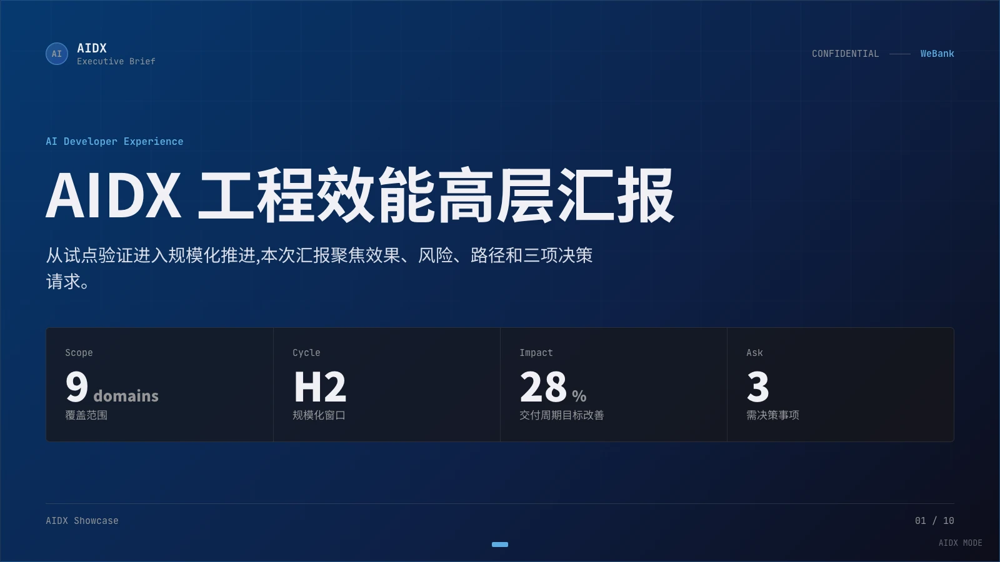
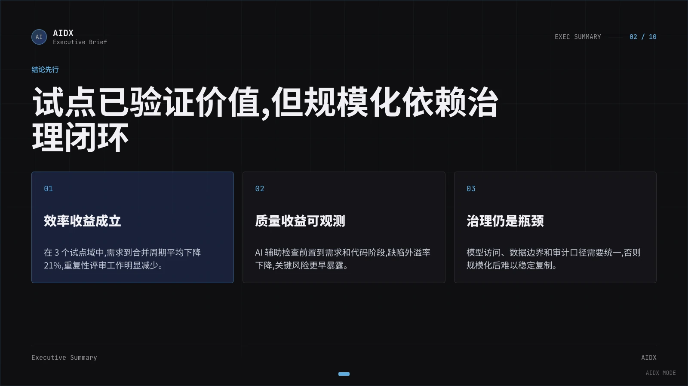

# aidx-ppt-skill · AIDX Executive HTML Decks


[](https://zhenfund.feishu.cn/share/base/form/shrcn1lAANF659o7EpWnxlR1VOh?sessionid=)


`aidx-ppt-skill` is an agent skill for Claude Code, Codex, and similar coding-agent environments. It generates **AIDX / WeBank internal executive brief** decks as single-file horizontal-swipe HTML, plus deck visuals and social cover pages.

The system is intentionally narrow: dark command-center surfaces, terminal texture, AIDX primary branding, WeBank endorsement, and conclusion-first executive communication. It is built for AI technology briefings, engineering productivity reviews, governance updates, risk escalation, resource requests, and roadmap decisions.

> Distilled by [Guizang](https://x.com/op7418) through repeated offline talks and internal briefing iterations. Sponsor and supporter details are listed in [SPONSORS.md](./SPONSORS.md).

## Preview

**AIDX Cover**



**AIDX Executive Summary**



Example: [AIDX Showcase](./examples/aidx-showcase.html) - 10 slides covering every registered layout from `AIDX-01` to `AIDX-10`.

## 30-second start

```bash
npx skills add https://github.com/bing5tui3/ppt-skills --skill aidx-ppt-skill
```

Or paste this to an AI agent with shell access:

```text
Install aidx-ppt-skill for me. Clone https://github.com/bing5tui3/ppt-skills into ~/.claude/skills/aidx-ppt-skill, then verify that SKILL.md, assets/, and references/ exist.
```

If you already installed it, update with:

```text
Update aidx-ppt-skill for me. Go to ~/.claude/skills/aidx-ppt-skill, run git pull, then tell me the latest commit.
```

Then ask your agent:

```text
Create an AIDX executive brief from this material, around 8-10 slides, with an executive summary, risk matrix, roadmap, and closing decision request.
```

Other useful prompts:

```text
Turn this engineering productivity review into an AIDX management brief.
Adapt this product screenshot into a 16:10 AIDX-09 evidence visual.
Create a 21:9 social cover from the core conclusion of this brief.
```

## Sponsors and Supporters

<a href="./SPONSORS.md">
  
</a>

`aidx-ppt-skill` is supported by **360 Security Lobster** as Gold Sponsor and by [ZhenFund Token Grant](https://zhenfund.feishu.cn/share/base/form/shrcn1lAANF659o7EpWnxlR1VOh?sessionid=). See [SPONSORS.md](./SPONSORS.md) for details.

## What you get

- **One AIDX visual system**: dark command center, terminal texture, bank-grade restraint, conclusion-first structure
- **Horizontal swipe navigation**: arrow keys, scroll wheel, touch swipe, bottom dots, and ESC overview
- **10 locked AIDX layouts**: cover, executive summary, key decision, KPI strip, roadmap, risk matrix, architecture map, comparison, evidence screenshot, closing request
- **Fixed brand theme**: AIDX colors, WeBank endorsement, dark default pages, light evidence pages
- **Optional Codex image flow**: evidence screenshot adaptation, architecture maps, risk/decision graphics, KPI visuals, and social covers
- **Social covers**: WeChat 21:9, 1:1 share card, Xiaohongshu 3:4, video thumbnails, and related variants
- **Low-power static mode**: press `B` to turn canvas animation into static visuals
- **Single HTML file**: no build step, no server, open directly in a browser
- **AIDX validator**: checks registered layouts, `.stage`, image slots, local paths, long-deck structure, and stale legacy references

## Fits / Doesn't Fit

**Fits**: AIDX / WeBank internal executive briefs, AI technology management updates, engineering productivity reports, platform governance, resource requests, risk escalation, roadmap reviews.

**Doesn't fit**: dense training decks, multi-user native PowerPoint editing, public marketing pages without AIDX / WeBank context.

## Common Use Cases

| Task | Recommended flow |
|------|------------------|
| Management progress brief | Start with three executive-summary conclusions, then support them with KPI, risk, and roadmap pages |
| Resource request / scope approval | Use `AIDX-03` key decision and `AIDX-10` closing request |
| Engineering productivity review | Use `AIDX-04` KPI, `AIDX-06` risk matrix, and `AIDX-07` architecture map |
| Product or workflow screenshot | Use `AIDX-09` 16:10 evidence screenshot and preserve the real content |
| Social covers | Generate WeChat, share-card, Xiaohongshu, and video cover variants from the same idea |
| Screenshot normalization | Follow `references/screenshot-framing.md` for faithful adaptation |

## Why HTML Decks

- **Agent-native editing**: HTML / CSS is plain text, so agents can read, edit, and validate it directly.
- **Higher visual density than Markdown**: precise layout, positioning, motion, interaction, and cover formats.
- **Lightweight delivery**: one HTML file can be opened, presented, sent, screenshotted, or recorded.
- **Better quality gates**: the AIDX validator catches layout drift, missing image slots, missing `.stage`, local paths, and stale legacy references.
- **One visual system across outputs**: decks, generated visuals, covers, and screenshot adaptations share the same AIDX rules.

## Platform Support

| Platform | Status | Notes |
|----------|--------|-------|
| Claude Code | Supported | Native Skill workflow for creating and iterating HTML decks |
| Codex | Supported | Good for deck generation, image generation, and browser-based visual QA |
| Cursor / other local agents | Works | Requires filesystem access and shell execution |
| Plain chatbot | Not recommended | Without filesystem and browser preview, full deck generation is hard to stabilize |

## Install

### Option 1: One-line install

```bash
npx skills add https://github.com/bing5tui3/ppt-skills --skill aidx-ppt-skill
```

### Option 2: Paste this to an AI

> Install the `aidx-ppt-skill` Claude Code skill for me. Steps:
>
> 1. Make sure `~/.claude/skills/` exists.
> 2. Run `git clone https://github.com/bing5tui3/ppt-skills.git ~/.claude/skills/aidx-ppt-skill`.
> 3. Verify: `ls ~/.claude/skills/aidx-ppt-skill/` should show `SKILL.md`, `assets/`, `references/`.

Manual install:

```bash
mkdir -p ~/.claude/skills
git clone https://github.com/bing5tui3/ppt-skills.git ~/.claude/skills/aidx-ppt-skill
```

## Workflow

1. **Clarify the brief**: audience, decision request, slide count, materials, and sensitive information.
2. **Copy the template**: use `assets/template-aidx.html` as `ppt/index.html`.
3. **Read the rules**: `themes-aidx.md`, `layouts-aidx.md`, and `checklist.md`.
4. **Plan the layout rhythm**: include summary, decision, KPI, roadmap, risk, and evidence pages.
5. **Fill the content**: write conclusions as titles, give KPI context, assign risk owners and mitigations.
6. **Handle images**: local images go under `images/` and require `data-image-slot`.
7. **Run validation**: `node scripts/validate-aidx-deck.mjs path/to/index.html`.
8. **Preview in browser**: check navigation, low-power mode, evidence slots, and text overflow.

## AIDX Layouts

| Layout | Use |
|---|---|
| `AIDX-01` | Cover / briefing entry |
| `AIDX-02` | Executive Summary / three conclusions |
| `AIDX-03` | Key Decision / approval request |
| `AIDX-04` | KPI Command Strip / progress signals |
| `AIDX-05` | Roadmap / staged rollout |
| `AIDX-06` | Risk Matrix / blockers and mitigations |
| `AIDX-07` | Architecture Map / capability map |
| `AIDX-08` | Before After / option comparison |
| `AIDX-09` | Evidence Screenshot / proof and workflow capture |
| `AIDX-10` | Closing Request / final asks |

## Repository Structure

```text
aidx-ppt-skill/
├── SKILL.md
├── README.md
├── README.en.md
├── assets/
│   ├── template-aidx.html
│   ├── motion.min.js
│   └── readme/
│       ├── aidx-cover.webp
│       └── aidx-executive-summary.webp
├── examples/
│   ├── README.md
│   └── aidx-showcase.html
├── scripts/
│   ├── build-aidx-examples.mjs
│   └── validate-aidx-deck.mjs
└── references/
    ├── checklist.md
    ├── components.md
    ├── image-prompts.md
    ├── layouts-aidx.md
    ├── screenshot-framing.md
    └── themes-aidx.md
```

## Development and Validation

Regenerate the example:

```bash
node scripts/build-aidx-examples.mjs
```

Validate an AIDX deck:

```bash
node scripts/validate-aidx-deck.mjs examples/aidx-showcase.html
```

Stale legacy-reference checks are built into the AIDX validator; run validation before submitting changes.

## License

This project is licensed under [GNU Affero General Public License v3.0](./LICENSE).
